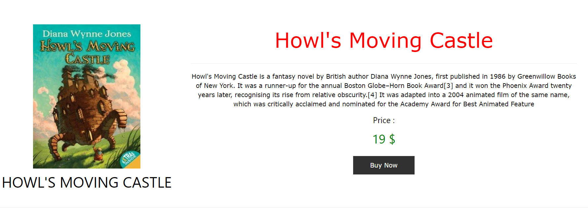

# E-BOOKS

## Online Book Buying Site

The project topic is about Book Store for the user and was done with using Java Servlet, JSP, MySQL WorkBench.  
The session, CRUD operations, Admin panel (Adding, deleting, editing, adding sub-categories to the database were done)  

      |
      |                       
     \ /  
      V
      
#### The first image illustrates page enter which has the type of books. On the top, the user can learn everything about the website, can check all books which exist, find everything about the writer, can contact with the admin of web page. And the most important thing is that the user can register and login to the system by creating an account. All users have privacy profile in which they can see the saved or favourites books.

      |
      |                       
     \ / 
      V

#### In the second image, User can find everything about the rate of book, reading rate, writer, the published date, price of books and payment rate. User can also get the money back if the book was not bought on purpose.

 

      |
      |                       
     \ / 
      V

#### In the third image, there is an instance of signed up the user in below. The registration of the people and the information of the people were made.

This project was made and belongs to the FURKAN KARA and FUAT KARA"github.com/BalamiRR".
